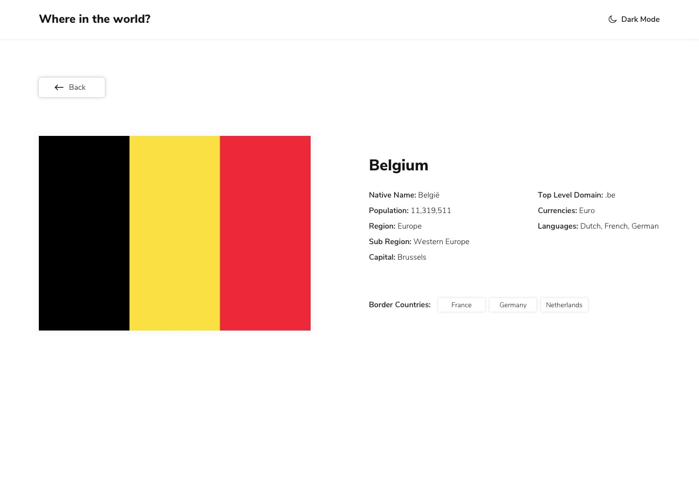

Your challenge is to build a web application using Next.js. The goal is to fetch data from the REST Countries API and display it according to provided designs.

Your users should be able to:

1. Display a comprehensive list of countries fetched from the [REST Countries API](https://restcountries.com/v3.1/all) directly on the homepage.
    - Ensure countries are fetched on the server-side.
2. Implement a search functionality enabling users to look up specific countries through an input field.
3. Provide options to filter countries by region.
4. Enable users to click on a country to access more detailed information displayed on a separate page.
5. Allow navigation to bordering countries directly from the detailed information page.
6. Deliver an interface that seamlessly adjusts to different screen sizes for optimal user experience across devices.
7. Enhance user interaction by incorporating hover and focus states for all interactive elements throughout the page.
8. Upload the project code to your GitHub repository.
    - Document how to execute the app locally
9. Implement unit testing for the project and ensure code coverage.
    - Document how to run the unit test and how the generate the coverage report in the README.md file.

**Bonus**: 
- Toggle the color scheme between light and dark mode